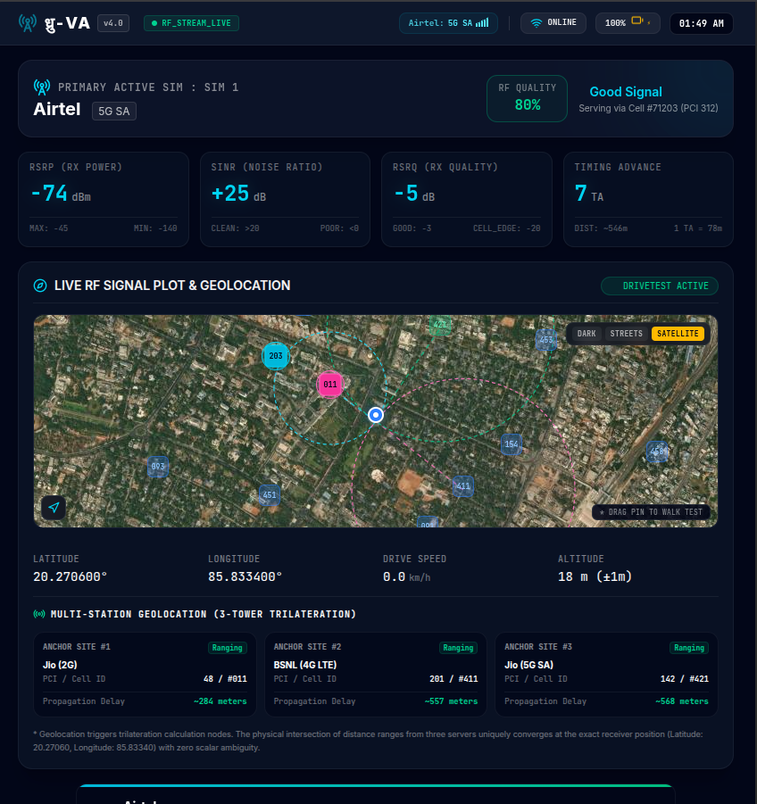
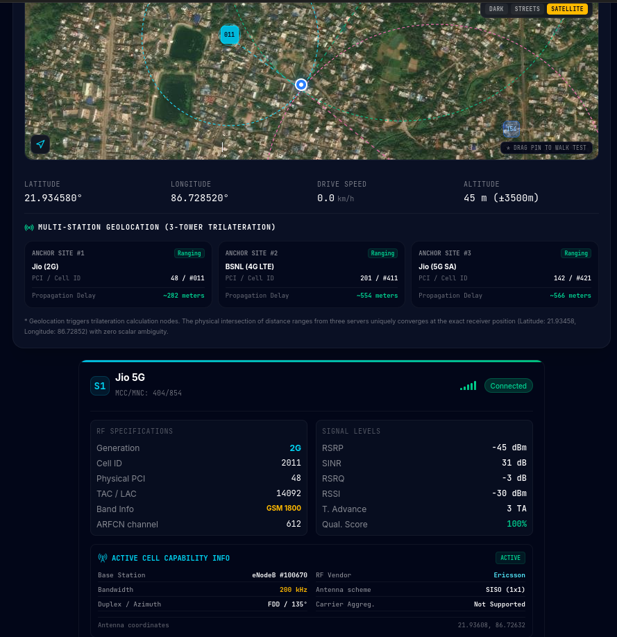
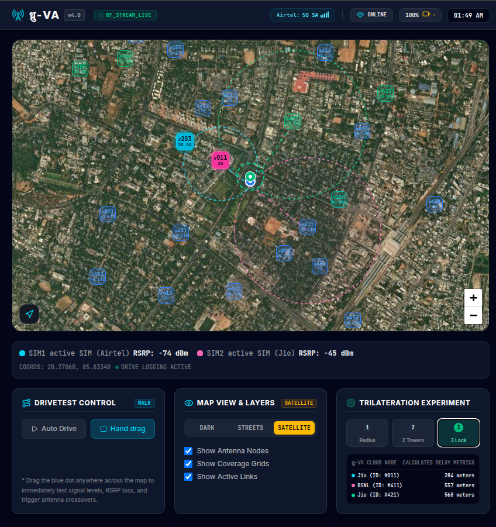
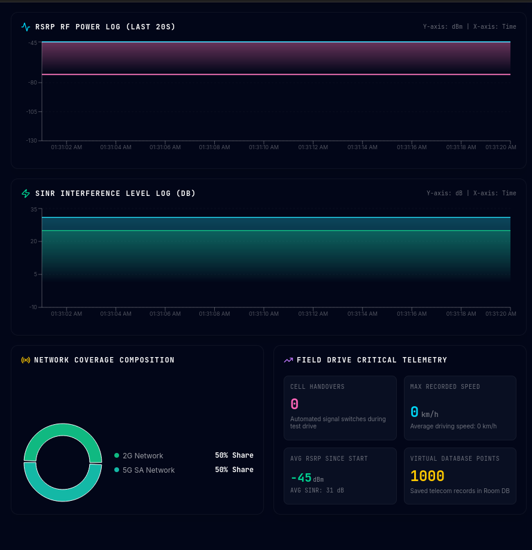
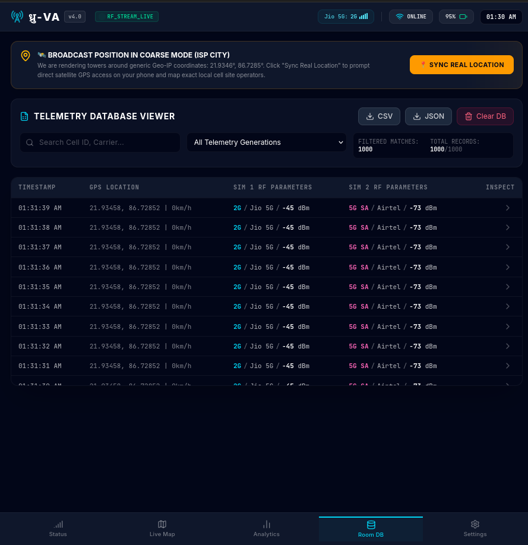

# ध्रु-VA (v4.0) — Multi-SIM Walk-Test RF Analyzer


<p align="center">

</p>

Advanced web-based RF survey platform for LTE/5G signal analysis, cell tower visualization, network diagnostics, and real-time telemetry.


*A professional RF engineering dashboard designed for telecom field testing, network optimization, and cellular analytics.*

</div>

---

# Overview

ध्रु-VA is a high-performance browser-based RF analysis platform built for telecom engineers, researchers, developers, and wireless enthusiasts.

The application provides an interactive workspace capable of visualizing live cellular measurements, network coverage, signal quality, cell handovers, and trilateration simulations.

Everything runs directly in the browser with an intuitive dashboard powered by React, Leaflet, and Tailwind CSS.

---

## 🚀 Key Features

* **Dual-SIM Live RF Diagnostics**: Real-time tracking of critical cellular parameters, including:
  * **RSRP** (Reference Signal Received Power)
  * **RSRQ** (Reference Signal Received Quality)
  * **SINR** (Signal-to-Interference-plus-Noise Ratio)
  * **RSSI** (Received Signal Strength Indicator)
  * **TA** (Timing Advance / delay metrics)
* **GIS Live Map Workspace**: Fully interactive, multi-layer Leaflet visualization rendering:
  * Simulated/real network cells and antenna radiation azimuths.
  * Real-time network handovers and coverage overlaps.
  * Adaptive styling based on active operators (e.g., Jio, Airtel, Vi, BSNL).
* **Trilateration Lab**: Step-by-step interactive algorithm solver illustrating how cellular nodes geolocate a device using circle-intersection geometry from 1, 2, or 3 surrounding basestation timing delays.
* **Telemetry Data Logger**: Captures historical walk-test records with speed, altitude, coordinates, and signal levels, saving directly to local storage with robust export capabilities.

### Multi Operator Support
Supports simultaneous visualization of :

- Jio
- Airtel
- Vodafone Idea
- BSNL

Each operator is rendered independently using unique styling for easier comparison.

---
<!-- IMAGES AND VIDEO -->


###  Dashboard



---

###  Live Map



---

###  Analytics



---

###  Logs



## 🎥 Demo Video

📹 [Watch the demo](./public/video.webm)

---

## Walk-Test Logger

Record complete drive tests including

- Latitude
- Longitude
- Speed
- Altitude
- RF measurements
- Timestamp
- Cell information

Export logs anytime.

---

## Analytics Dashboard

Comprehensive signal analytics including

- Signal distribution
- Performance graphs
- Coverage statistics
- Quality indicators
- Network health
- Historical trends

---

## Cell Tower Trilateration

Interactive educational module explaining

- Circle intersection
- Distance estimation
- Timing Advance
- Device positioning
- Multi-cell localization

Perfect for understanding how cellular positioning works.

---

### 📡 RF Color Mapping Reference
* **RSRP >= -80 dBm** — <span style="color:#10b981">Excellent (Emerald)</span>: Strong signal; 256-QAM high-speed operations.
* **RSRP -81 to -90 dBm** — <span style="color:#06b6d4">Good (Cyan)</span>: Steady coverage; supports rich multimedia streams.
* **RSRP -91 to -100 dBm** — <span style="color:#f59e0b">Fair (Amber)</span>: Average signal; cell border operations.
* **RSRP -101 to -112 dBm** — <span style="color:#f43f5e">Poor (Rose)</span>: Weak coverage; likely to fail handover.
* **RSRP < -112 dBm** — <span style="color:#ef4444">Critical (Red)</span>: High attenuation; dropped calls imminent.


---

## Hardware Implementation Guide (Real-Time Operation)
For complete hardware setup, wiring diagrams, firmware, and implementation details, see the
<p align="left">

<a href="./doc/hardware.md">
    
</a>

</p>

--- 
## 📚 Additional Documentation

- 🏠 [Technology Stack](./doc/Technology.md)
- 🔌 [Modules](./doc/Modules.md)
- 📡 [Metrics](./doc/Metrics.md)
- 🤖 [Compatibility](./doc/Compatibility.md)
- 📖 [Features](./doc/Features.md)
- 📖 [EXTRA](./docs/Extra.md)
---

# Installation

### Git
```bash
git clone https://github.com/yourusername/dhru-va.git

cd dhru-va

npm install

npm run dev
```

### Build

```bash
npm run build
```

### Preview

```bash
npm run preview
```

---

## 🏗️ Directory Layout

```
.
├── /public
│   └── favicon.ico         # Custom logo visual asset
├── /src
│   ├── /components
│   │   ├── MapTab.tsx      # Core GIS Leaflet map implementation with bento layout
│   │   ├── MiniMap.tsx     # Floating sidebar quick-view locator map
│   │   ├── DashboardTab.tsx# Deep telemetry analyzer meters
│   │   ├── AnalyticsTab.tsx# Spectral heatmaps & histogram charting
│   │   ├── LogsTab.tsx     # Route walk-test logs with CSV export tools
│   │   └── SettingsTab.tsx # Operator, system noise, and threshold properties
│   ├── /utils
│   │   ├── db.ts           # Local storage adapter
│   │   └── telemetryGen.ts # RF propagation models & NMEA computations
│   ├── types.ts            # Global network interfaces
│   ├── App.tsx             # Workspace entry container
│   └── main.tsx            # React DOM initializer
├── index.html              # HTML shell
├── package.json            # Node configuration scripts
└── tsconfig.json           # Compiler rules
```
To be added more fetures 

---

# Contributing

Contributions are welcome.

Fork the repository, create your feature branch, and submit a pull request.

---


<div align="center">

Built with ❤️ for Telecom Engineers, RF Researchers, and Network Enthusiasts.

**ध्रु-VA — Visualizing Cellular Networks Beyond Signal Bars.**

</div>